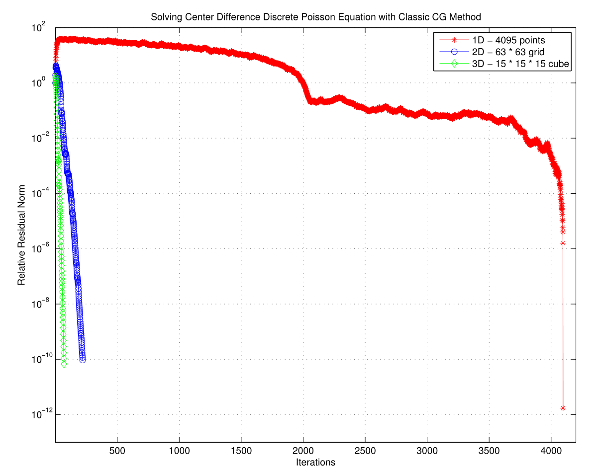
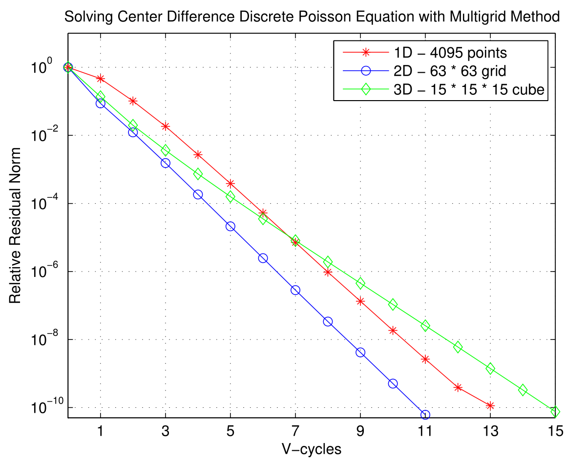

# Poisson Equation Solver with Finite Difference Method and Multigrid

Yet another "byproduct" of my course CSE 6644 / MATH 6644. :)

Using finite difference method to discrete Poisson equation in 1D, 2D, 3D and use multigrid method to accelerate the solving of the linear system. I use center difference for the second order derivative. The right hand side is set as random numbers.

Use `test_Poisson{1,2,3}D(p)` to test the solver. `p` indicates that on each the edge of each dimension, there are $2^p-1$ inner grid points and $2$ boundary points, and the rank of the coefficient matrix is $(2^p-1)^d$, where $d \in \{1, 2, 3\}$ is the dimension of the problem. Full weighting restriction/prolongation operators and Galerkin coarse grid $A^H = R A P$, where $R$ is restriction operator and $P = 2^d R^T$ is prolongation operator.

The `Multigrid_Solver()` will first call `Multigrid{1,2,3}D_Vcycle_GenMat()` to generate the coefficient matrices and restriction operators on each level and store them, then it will call `Multigrid_Vcycle()` to perform V-cycle computation until the relative residual norm is smaller than the given threshold. `Multigrid_Solver()` use Gauss-Seidel method as the default pre- and post-smoother, with 1 pre- and post-smoothing. 

Here is a brief comparison:

